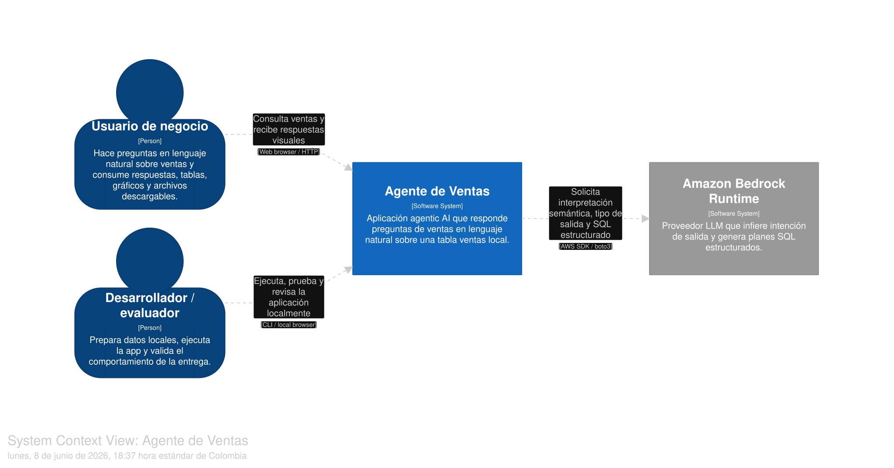
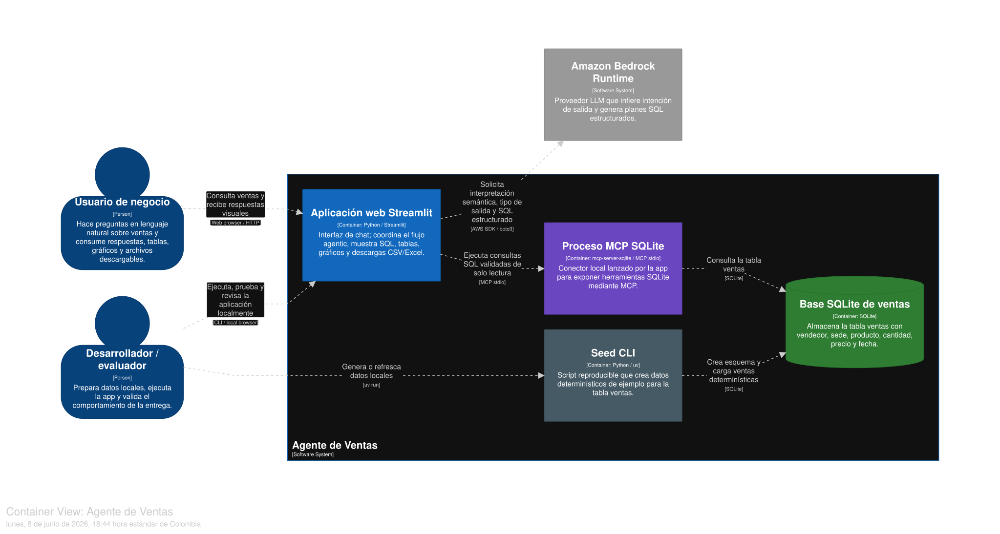
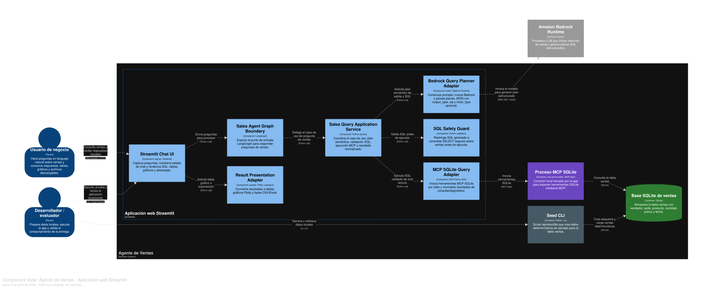

# Agente de Ventas

Guía de uso para la aplicación práctica de análisis de ventas con IA agentiva. El flujo de la app permite hacer preguntas en lenguaje natural sobre la tabla SQLite `ventas` y visualizar respuestas en Streamlit.

## Qué podés probar

- Preguntas de ventas en lenguaje natural.
- SQL generado visible para revisar qué ejecuta el agente.
- Resultados en tabla.
- Gráficos Plotly seguros: barras, pastel, línea y dispersión.
- Descargas CSV y Excel.

## Arquitectura C4

El modelo C4 está guardado en `docs/architecture/` para que el diseño sea replicable en Structurizr Playground o con un validador Structurizr local.

### C1 — Contexto del sistema

El C1 muestra el sistema como caja negra: el usuario de negocio y el desarrollador/evaluador interactúan con el `Agente de Ventas`, que usa Amazon Bedrock para interpretar intención, tipo de salida y SQL estructurado.



DSL: [`docs/architecture/c4-agente-ventas-c1.dsl`](docs/architecture/c4-agente-ventas-c1.dsl)

### C2 — Contenedores

El C2 abre `Agente de Ventas` y separa sus unidades principales: la app Streamlit, el proceso MCP SQLite, el script de seed y la base SQLite local. Bedrock queda fuera como sistema externo.



DSL: [`docs/architecture/c4-agente-ventas-c2.dsl`](docs/architecture/c4-agente-ventas-c2.dsl)

### C3 — Componentes de Streamlit

El C3 descompone solo el contenedor `Aplicación web Streamlit`: UI, frontera LangGraph, servicio de consulta, adaptador Bedrock, guardia SQL, adaptador MCP y presentación/exportación de resultados.



DSL: [`docs/architecture/c4-agente-ventas-c3-streamlit.dsl`](docs/architecture/c4-agente-ventas-c3-streamlit.dsl)

## Configuración

Copiá `.env.example` o exportá estas variables en tu shell:

```bash
export AWS_REGION=us-east-1
export BEDROCK_MODEL_ID=anthropic.claude-3-haiku-20240307-v1:0
export SALES_DB_PATH=data/sales.db
```

Las credenciales de AWS deben venir de tu configuración local normal, por ejemplo AWS CLI/SSO o variables de entorno. No guardes credenciales en el repo.

## Comandos verificados

Generar la base local:

```bash
uv run python scripts/seed_database.py
```

Ejecutar la suite de tests:

```bash
uv run pytest
```

## Prueba manual de Streamlit

La UI vive en `app.py`. Levantala con Streamlit desde el entorno del proyecto y probá los prompts de abajo con credenciales Bedrock configuradas.

## Prompts de prueba

Tabla:

```text
Muéstrame los 5 productos más vendidos
```

Gráfico de barras:

```text
Hazme un gráfico de barras con la cantidad vendida por producto
```

Gráfico de pastel:

```text
Muéstrame un gráfico de pastel con la participación de cantidad vendida por producto
```

Gráfico de línea:

```text
Grafica en línea la cantidad total vendida por mes
```

Gráfico de dispersión:

```text
Grafica la relación entre cantidad vendida e ingresos por producto
```

CSV:

```text
Dame en CSV el total vendido por vendedor
```

Excel:

```text
Exporta a Excel las ventas totales por sede
```

## Formatos soportados

Bedrock devuelve un plan JSON estricto con `output_type`, `sql` y, para gráficos, `chart_type`. Streamlit renderiza ese plan validado; no decide el tipo de salida con keywords.

| Salida | Comportamiento |
| --- | --- |
| `table` | Muestra SQL generado y dataframe. |
| `chart` | Muestra SQL, dataframe y gráfico Plotly. |
| `csv` | Muestra SQL, dataframe y botón de descarga CSV. |
| `excel` | Muestra SQL, dataframe y botón de descarga Excel. |

Tipos de gráfico permitidos:

| `chart_type` | Uso | Forma esperada del resultado SQL |
| --- | --- | --- |
| `bar` | Comparaciones o rankings | categoría + valor numérico |
| `pie` | Participación por categoría | categoría + valor numérico |
| `line` | Tendencias por fecha/mes | fecha/categoría ordenada + valor numérico |
| `scatter` | Relación entre dos métricas | dos columnas numéricas, o etiqueta + dos columnas numéricas |

## Limitaciones

- El validador SQL es conservador y usa reglas por tokens/regex; no es un parser SQL completo.
- El agente solo responde sobre la tabla `ventas`.
- No se exponen herramientas MCP peligrosas como `write_query` o `create_table`.
- Los gráficos usan una matriz segura y fija de Plotly; el modelo no puede elegir funciones arbitrarias.
- Si una consulta no devuelve filas, no se renderiza gráfico ni botón de descarga.
- Docker/Compose no se documenta como verificación final en este README; usá `uv run pytest` y la prueba manual de Streamlit como validación principal.
